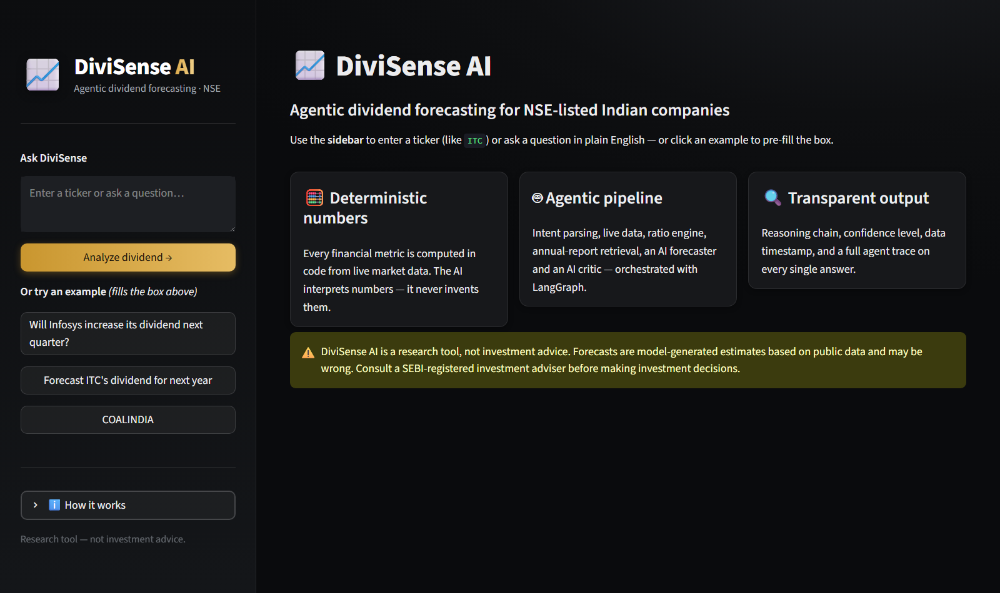
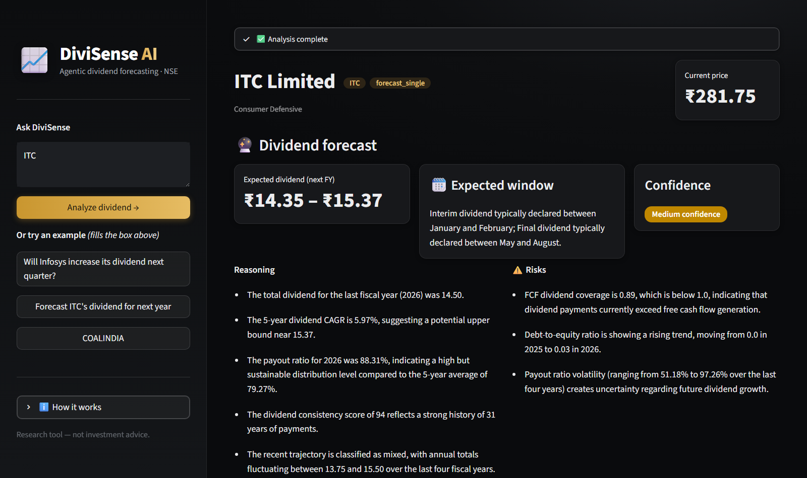
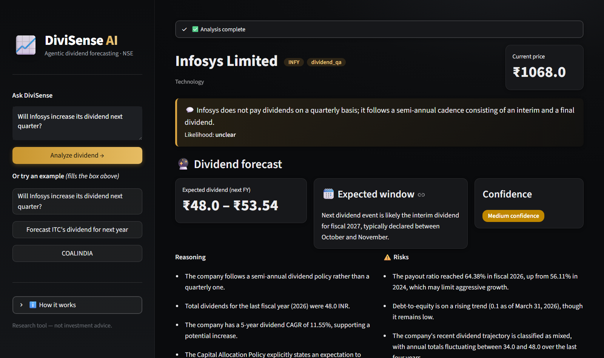
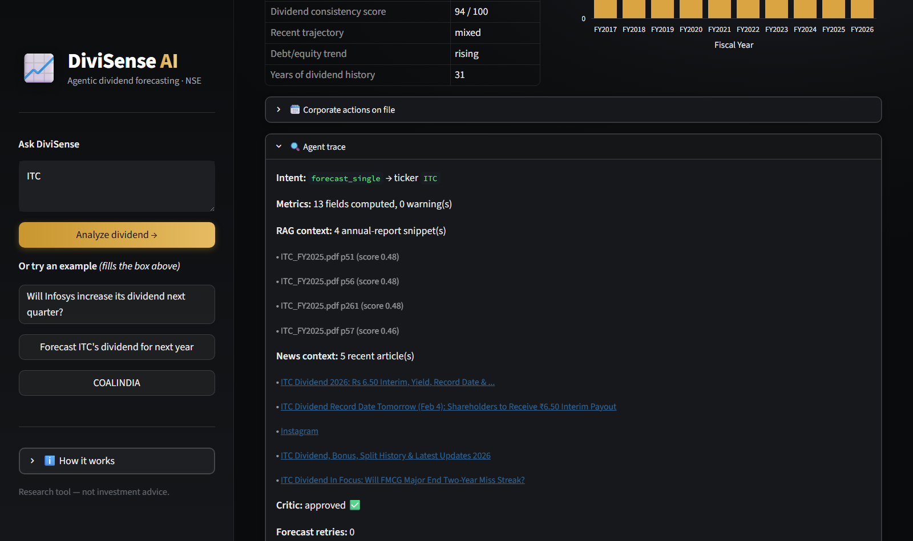

# DiviSense AI

**Agentic dividend forecasting for NSE-listed Indian companies.** Ask a
natural-language question about one company — or just type a ticker — and get a
next-fiscal-year dividend forecast with transparent reasoning, a confidence level,
key risks, and a `data as of` timestamp.

DiviSense AI runs a multi-agent [LangGraph](https://langchain-ai.github.io/langgraph/)
pipeline: an **Intent Agent** parses your query, a live **yfinance** fetch pulls the
company's financials, a deterministic **pandas ratio engine** computes every number,
**RAG** over annual reports and a **Tavily news search** add qualitative context, and a
question-aware **Forecast Agent** + **Critic Agent** produce the answer. LLMs interpret
numbers; they never compute or recall them.

> ⚠️ **Research tool, not investment advice.** See the [disclaimer](#disclaimer).

See **[ARCHITECTURE.md](ARCHITECTURE.md)** for the full design — it is the source of
truth for tier boundaries, the golden rules, and the enhancement roadmap.

---

## What it can answer

DiviSense AI is a **single-company tool**. It handles three kinds of query:

| Intent | Example input | What you get |
|---|---|---|
| **Forecast** | `Forecast ITC's dividend for next year` &nbsp;·&nbsp; `ITC` | Next-FY dividend range (₹/share), likely interim/final split, expected window, confidence, reasoning, risks |
| **Direct question** | `Will Infosys increase its dividend next quarter?` | A direct answer first (*likely yes / likely no / unclear* + likelihood), then the supporting forecast and metrics |
| **Clarify** | Ambiguous or unresolvable input | A friendly request to rephrase, with examples |

The two canonical example queries:

```text
Will Infosys increase its dividend next quarter?
Forecast ITC's dividend for next year
```

A bare ticker (`ITC`, `COALINDIA`, `INFY`) skips the intent LLM entirely and goes
straight to a forecast.

**Out of scope (MVP):** multi-company screeners and rankings ("top dividend payers…")
are classified `out_of_scope` and answered with a friendly note — they are a planned
v1.1 enhancement (see the [roadmap](#enhancement-roadmap)).

---

## Architecture at a glance

Four tiers, orchestrated by LangGraph (full detail in
**[ARCHITECTURE.md](ARCHITECTURE.md)**):

```
Tier 4  Presentation      Streamlit UI (app.py) + CLI (forecast.py)
Tier 3  Agentic           LangGraph StateGraph (graph.py):
        orchestration       Intent → Data → Ratio → RAG → News →
                            Forecast → Critic → Report
Tier 2  Intelligence /    ratio_engine.py (pure pandas) · rag.py (Chroma) ·
        knowledge / LLM     news.py (Tavily) · llm_router.py (Groq → Gemini)
Tier 1  Data acquisition  data_agent.py (yfinance) · ticker_map.py ·
                            corp_actions.py · cache.py · pdf_ingest.py
```

**Design guarantees:** deterministic where money is involved; ≤3 LLM calls per query
(2 for a bare ticker); fetch-on-demand freshness (1-hour cache); graceful degradation
everywhere; reasoning + confidence + timestamp + disclaimer on every output. Free-tier
LLMs only (Groq primary, Gemini fallback). Runs entirely on a local laptop.

---

## Setup

**Prerequisites:** Python 3.11+ and git.

### 1. Clone and create a virtual environment

**Windows / PowerShell:**

```powershell
git clone https://github.com/smahendra2601/divisense-ai.git
cd divisense-ai

python -m venv .venv
.venv\Scripts\Activate.ps1
pip install -r requirements.txt
```

**macOS / Linux:**

```bash
git clone https://github.com/smahendra2601/divisense-ai.git
cd divisense-ai

python3 -m venv .venv
source .venv/bin/activate
pip install -r requirements.txt
```

### 2. Configure API keys

Copy the template and fill in your keys:

```powershell
copy .env.example .env      # PowerShell
# cp .env.example .env       # bash
```

| Variable | Required? | Where to get it (free tier) |
|---|---|---|
| `GROQ_API_KEY` | **Yes** — primary LLM | [console.groq.com](https://console.groq.com) → *API Keys* |
| `GOOGLE_API_KEY` | **Yes** — Gemini fallback | [aistudio.google.com](https://aistudio.google.com) → *Get API key* |
| `TAVILY_API_KEY` | Optional — recent-news context | [tavily.com](https://tavily.com) → *Get API key* |

All three tiers are free. Without `TAVILY_API_KEY` the pipeline runs identically, just
without the recent-news context — it is never required. Keys live only in `.env`
(git-ignored); never commit them.

---

## Ingesting an annual report (optional RAG context)

The pipeline works without RAG, but ingesting a company's annual report gives the
Forecast Agent qualitative context (dividend policy, capital-allocation language).

Place PDFs in `data/annual_reports/`, named `<TICKER>_<anything>.pdf`
(e.g. `ITC_FY2025.pdf`), then ingest:

```powershell
python -m src.pdf_ingest --all                                    # every PDF in the folder
python -m src.pdf_ingest ITC data\annual_reports\ITC_FY2025.pdf   # a single file
```

**Where to get the PDFs:** each company's investor-relations page, or NSE's public
filings — after visiting nseindia.com once (for cookies),
`https://www.nseindia.com/api/annual-reports?index=equities&symbol=<TICKER>` returns
JSON with direct PDF links. Re-ingesting the same file updates it in place (no
duplicates).

Check what a ticker's index returns:

```powershell
python -m src.rag ITC "dividend policy"
```

---

## Running it

### Streamlit UI

```powershell
streamlit run app.py
```

A natural-language question box with example chips, a direct-answer banner, a forecast
card (amount range, expected window, confidence badge, reasoning, risks), a key-metrics
table, a dividend-history chart, and an expandable **🔍 Agent trace** that shows every
node's output.

### CLI

```powershell
python forecast.py "Will Infosys increase its dividend next quarter?"
python forecast.py ITC
```

### Backtest (forecast accuracy)

Hides the most recent complete fiscal year, forecasts it from the truncated history,
and scores the prediction against the withheld actual. RAG and news are disabled during
a run so the withheld answer can't leak.

```powershell
python backtest.py                # default: ITC, TCS, COALINDIA
python backtest.py INFY SBIN      # any tickers
```

### Tests

```powershell
pytest -m "not integration"       # full offline suite (LLM + network mocked)
pytest                            # include live integration tests (needs keys)
```

---

## Screenshots

**Home — enter a ticker or ask a question (example chips pre-fill the box):**



**Forecast result — amount range, expected window, confidence, reasoning and risks (`ITC`):**



**Direct question — the answer comes first, then the supporting forecast
(*"Will Infosys increase its dividend next quarter?"*):**



**Agent trace — annual-report RAG snippets, recent-news context, and the Critic's
verdict, attached to every answer:**



---

## Enhancement roadmap

The architecture leaves clear plug-in points for post-MVP work (full table in
**[ARCHITECTURE.md §7](ARCHITECTURE.md)**):

- **v1.1** — **Screener / ranking queries** ("top PSU dividend payers"); NSE/BSE live
  corporate-actions scraper; Screener.in fundamentals enrichment; multi-turn
  conversation memory.
- **v1.2** — Scheduled watchlist monitoring + alerts; the backtesting module *(already
  shipped as `backtest.py`)*.
- **v1.3** — Peer / sector comparison agent; news & announcement **sentiment** scoring
  *(recent-news **context** already shipped via `news.py`)*; cleaner news context
  (relevance-score floor and/or an LLM summarizer node).
- **v2.0** — FastAPI + React frontend and multi-user; PostgreSQL forecast history;
  Docker deploy.
- **v2.1** — Local LLM option (Ollama) for zero-quota operation; portfolio mode.

---

## Disclaimer

> ⚠️ DiviSense AI is a research tool, not investment advice. Forecasts are
> model-generated estimates based on public data and may be wrong. Consult a
> SEBI-registered investment adviser before making investment decisions.
